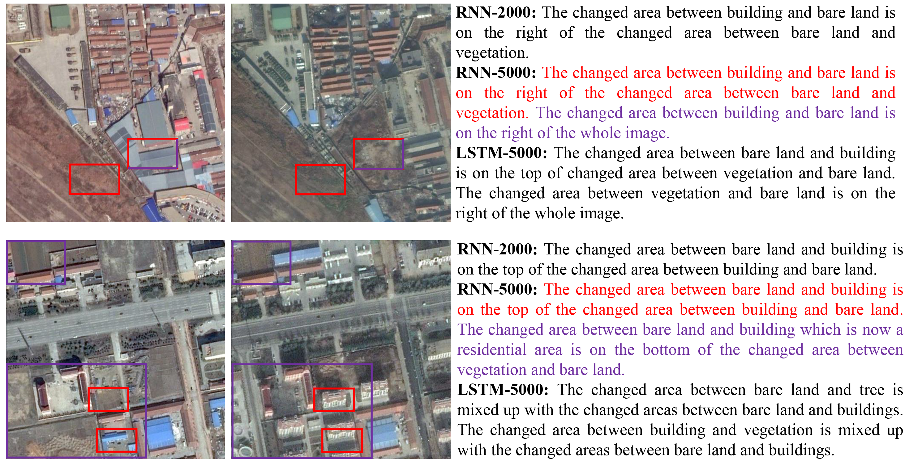

# CI-Net-on-SECTION-dataset
This is a dataset created for the research of change captioning, which consists of 4059 data samples of over 2000 scenes and 12200 annotated captions to better serve as a research platform for change captioning. In the folder "CI-Net-on-SECTION-dataset/Data/", several examples of multi-caption annotations based on SECOND dataset are reserved, which are displayed as follows.

  

  

  
Fig.1 Examples of data samples in SECTION dataset.

  

 
SECOND dataset is a large scale semantic change detection dataset for earth observation, where the data samples are derived from cities and urbans world-wide.

 

  

  

 
Fig.2 Examples of data samples in SECOND dataset.

  

 
We propose a novel CI-Net to obtain serial captions of various contents without extra costs required by auxiliary tasks. In the following figure, we display several model results derived from CI-Net with different settings. We surprisingly find out that, CI-Net can even obtain the caption (purple) with complicated attributive clauses, which can hardly generated by existing change captioning methods.

 

  

 
Fig.3 Examples of model results from CI-Net on SECTION dataset.

  

 
The whole dataset and code will be available soon here in the future. (See folder "CI-Net-on-SECTION-dataset/Data/")

 

