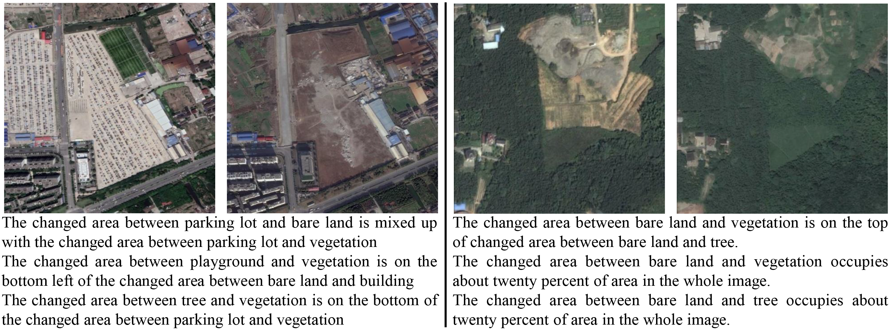
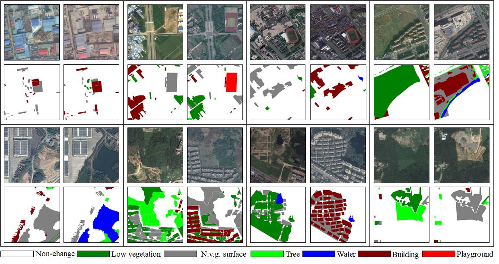

# CI-Net-on-SECTION-dataset
This is a dataset created for the research of change captioning, which consists of 4059 data samples of over 2000 scenes and 12200 annotated captions to better serve as a research platform for change captioning. In the folder "CI-Net-on-SECTION-dataset/figures/", several examples of multi-caption annotations based on SECOND dataset are reserved, which are displayed as follows.

  

  

  
Fig.1 Examples of Data Samples in SECTION dataset.

  

 
SECOND dataset is a large scale semantic change detection dataset for earth observation, where the data samples are derived from cities and urbans world-wide.

 

  

  

 
Fig.2 Examples of Data Samples in SECOND dataset.

  

 
The whole dataset and code will be available soon here in the future.

 

